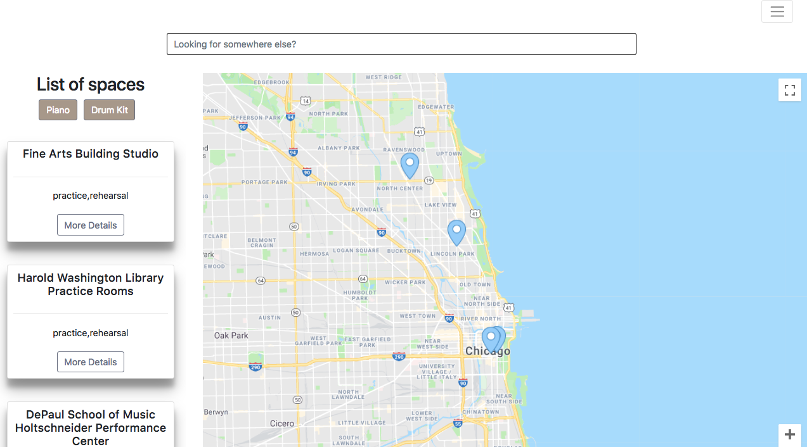
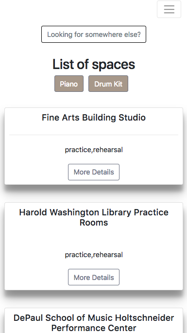
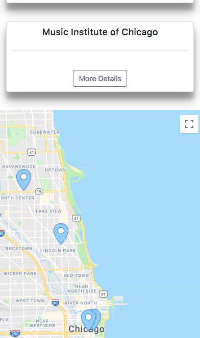
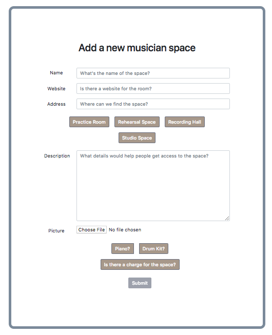

# MUSICIAN SPACE

A RESOURCE FOR MUSICIANS TO FIND PRACTICE ROOMS AROUND THE WORLD.


### Filter your results by location



### Responsive on mobile devices




### Add new spaces



## Global information

### Files to add

You should have a `server/.env` file, with for example the following values:

```
CLOUDINARY_CLOUD_NAME=......
CLOUDINARY_API_KEY=......
CLOUDINARY_API_SECRET=......
MONGODB_URI=......
```

## Commands

###To download

**To install all the packages**

$ git clone

**To install all the packages**

```sh
$ npm install
# OR
$ (cd server && npm install)
$ (cd client && npm install)
```

**To install a package for the server**

```sh
$ cd server
$ npm install --save axios
```

**To install a package for the client**

```sh
$ cd client
$ npm install --save axios
```

**To run the server and the client**

```sh
# Open a first terminal
$ npm run dev:server
# Run the server on http://localhost:5000/

# Open a second terminal
$ npm run dev:client
# Run the client on http://localhost:3000/
```
